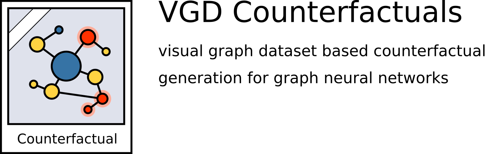

|made-with-python| |python-version| |version|

.. |made-with-python| image:: https://img.shields.io/badge/Made%20with-Python-1f425f.svg
   :target: https://www.python.org/

.. |python-version| image:: https://img.shields.io/badge/Python-3.8.0-green.svg
   :target: https://www.python.org/

.. |version| image:: https://img.shields.io/badge/version-0.1.0-orange.svg
   :target: https://www.python.org/

=============
VGD Counterfactuals
=============

Library for the generation and more importantly the easy visualization of **Counterfactuals** for
**Graph Neural Networks (GNNs)** based on the `Visual Graph Dataset`_ dataset format.

.. _`Visual Graph Dataset`: https://github.com/the16thpythonist/visual_graph_datasets

What are Counterfactuals?
=========================

To do: Explain how this is generally supposed to work

Installation
============

.. code-block:: shell

    git clone https://github.com/the16thpythonist/vgd_counterfactuals

Then in the main folder run a ``pip install``:

.. code-block:: shell

    cd vgd_counterfactuals
    python3 -m pip install .

Afterwards, you can check the install by invoking the CLI:

.. code-block:: shell

    python3 -m vgd_counterfactuals.cli --version
    python3 -m vgd_counterfactuals.cli --help

Usage
=====

Quickstart
----------

The generation of counterfactual graphs requires the following 4 pre-requisites.

Computational Experiments
-------------------------

It is possible to list, show and execute all the computational experiments using a command line interface
(CLI).

All the available experiments can be listed like this:

.. code-block:: shell

    python3 -m vgd_counterfactuals.cli list

The details for a specific experiment can be viewed like this:

.. code-block:: shell

    python3 -m vgd_counterfactuals.cli info [experiment_name]

A new run of an experiment can be started like this.

.. code-block::

    python3 -m vgd_counterfactuals.cli run [experiment_name]

Be aware that the execution of any experiment will most likely take a lot of time.

Each experiment will create a new archive folder, which will contain all the artifacts (such as visual
examples and the raw data) created during the runtime. The location of this archive folder can be found
from the output generated by the experiment execution.

Archived Experiments
--------------------

To view the detailed data which was used in the making of the paper, go to
``vgd_counterfactuals/experiments``. The subfolders in that folder contain the archived experiments.
These contain extensive examples for each repetition of the various experiments as well as all of the raw
data collected during the execution of the experiments.

Credits
=======

* PyComex_ is a micro framework which simplifies the setup, processing and management of computational
  experiments. It is also used to auto-generate the command line interface that can be used to interact
  with these experiments.

.. _PyComex: https://github.com/the16thpythonist/pycomex.git